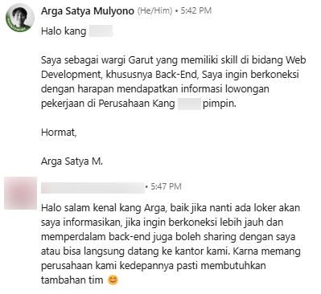

## Pembuka

Halo semuanya, ini postingan pertamaku di Artikel. Maaf kalau kesannya agak lebay 😅  
Di tulisan ini aku mau sharing apa aja yang aku dapet dari setahun kerja sebagai Backend Developer di sebuah software house.

## Awal Mula

Di tahun 2023 aku lulus sebagai D3 Teknik Informatika. Setelah lulus, aku sempat ikut bootcamp yang katanya ada program penyaluran kerja. Tapi setelah beberapa bulan, hasilnya nihil (mungkin belum rezeki di situ).

Akhirnya aku mulai cari info sendiri tentang perusahaan IT di kota tempat aku tinggal lewat LinkedIn—dan ketemu satu. Aku coba hubungi salah satu pimpinan di sana, dan percakapan kami kurang lebih kayak gini:

Ternyata di perusahaan itu ada teman kuliahku juga. Aku minta tolong ke dia buat bantu follow up, dan akhirnya aku dipanggil dan ditawari posisi. Di bulan November, aku resmi mulai masa probation.

## Proses Bekerja

Awal-awal kerja, aku lumayan gugup. Pengalaman kerjaku cuma magang sebulan sebagai Web Developer. Tapi untungnya, semua rekan kerja di sana baik dan supportive.

Karena semua tech stack-nya pakai JavaScript (ExpressJS & NextJS), aku harus adaptasi. Soalnya sebelumnya aku belajar PHP dan Go. Untungnya aku masih cukup paham dasar-dasar JavaScript.

Proyek pertamaku adalah sistem booking service barang elektronik—lebih tepatnya fixing bug dan nambahin beberapa fitur.

Setelah itu aku dipercaya ikut proyek ERP, walaupun waktu itu aku cuma kerjain fitur filterisasi. Tapi itu cukup menantang karena harus integrasi langsung ke frontend-nya yang pakai NextJS.

Lanjut ke proyek HR sebagai pelengkap ERP. Di situ aku mulai semangat banget karena dikasih kebebasan coba tech baru: Hono (katanya whus whusss 🚀). Aku riset, dan setelah ngobrol sama senior, akhirnya boleh pakai framework itu.

Di sela-sela proyek HR, aku ditawarin buat handle sistem _self service photobooth_. Jujur, awalnya aku ragu:

> Waduh, bakal susah gak ya?

Tapi seniorku kasih semangat, dan akhirnya aku coba. Di proyek itu aku pertama kali integrasi third-party payment. Prosesnya butuh beberapa bulan sampai akhirnya jalan. UI-nya pakai Electron.

## Momen yang Paling Berkesan

Momen paling berkesan? Saat sistem yang aku bikin pertama kali akhirnya dipakai banyak orang—terutama sistem photobooth itu. Rasanya seneng dan bangga banget.

Teman-teman sekolahku pun aku lihat pakai sistem itu. Dalam hati aku ngomong:

> Damn, bangga banget.

Walaupun sistemnya belum sempurna, tetap terasa sangat berarti.

## Pelajaran yang Bisa Diambil

Selama setahun, performaku mungkin nggak selalu maksimal. Tapi aku terus berusaha kasih yang terbaik.

Aku belajar kalau dunia IT itu nggak ada habisnya—harus terus belajar, jangan takut ngasih ide, dan jangan baper kalau dikritik.

## Penutup

Terima kasih banget buat Kang A yang udah kasih aku kesempatan pertama di dunia kerja.  
Terima kasih juga buat rekan-rekan lainnya yang udah nerima aku dengan baik.  
Dan tentu aja, makasih buat diri sendiri karena udah mau terus jalan sampai titik ini.

Love you all! ❤️
